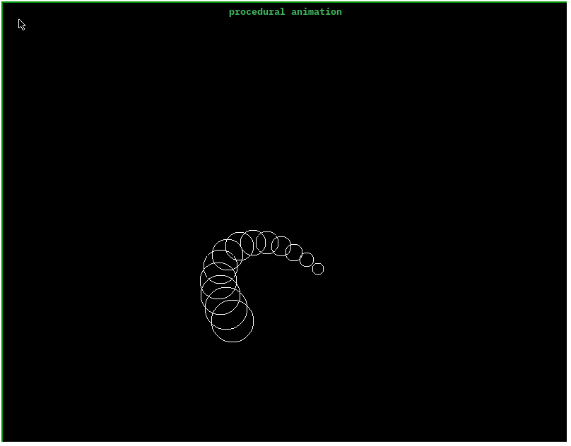

# Simple Procedural Animation (C and Raylib)

A simple Simple Procedural Animation made with C and raylib

## What does it do
* **Simulate a snake like body animation**.
* **Control by mouse:** Click or Hold the Right Mouse Button to move

## Example Output


## How to Build & Run

### 1. Compile
You can compile the source code using `make`:
```bash
make
sudo ./procedural
